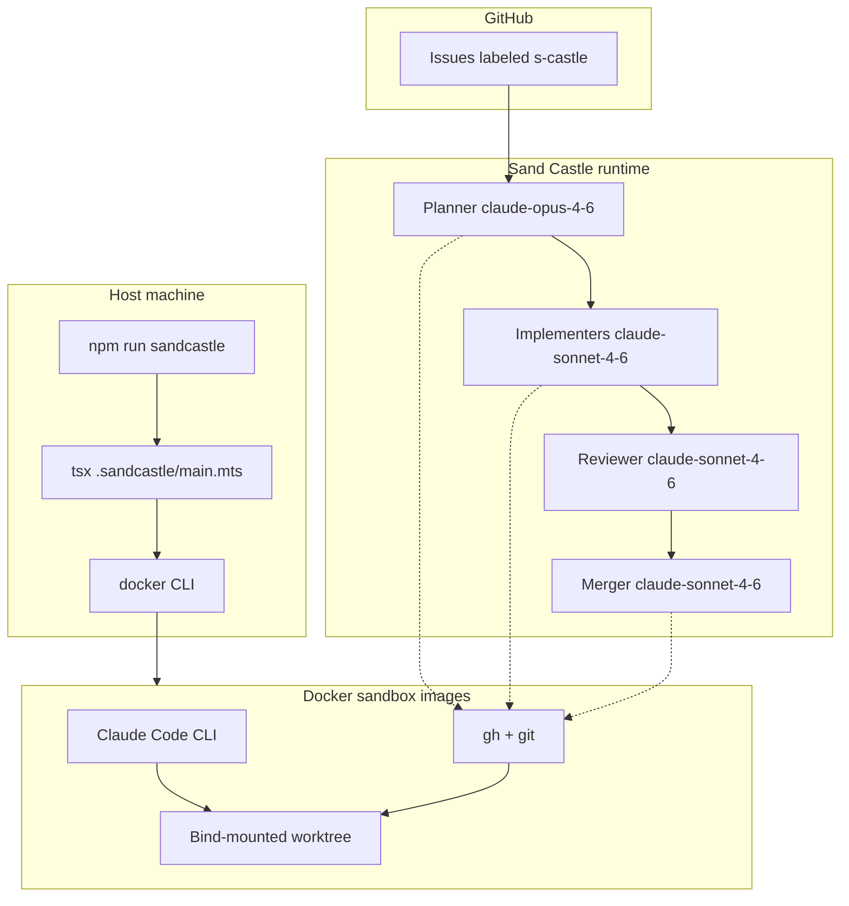

# Sand Castle on forecaste_v2 — exhaustive setup documentary

This document records **everything that was done** to integrate [**Sand Castle**](https://github.com/mattpocock/sandcastle) ([`@ai-hero/sandcastle`](https://www.npmjs.com/package/@ai-hero/sandcastle)) into **forecaste_v2**: a **Next.js 15** app with the App Router, **React 19**, **TypeScript**, **Tailwind CSS v4**, and **GSAP**.

Use it as a **replayable playbook** (re-derive the same setup on a fresh clone) and as **onboarding** for anyone running or changing the factory.

**Related docs (read next):**

- [TOKENS-AND-WIRING-GUIDE.md](TOKENS-AND-WIRING-GUIDE.md) — credentials, layered smoke tests, `gh` + Docker checks.
- [SAND-CASTLE-AFK-FACTORY-GUIDE.md](SAND-CASTLE-AFK-FACTORY-GUIDE.md) — conceptual “why” and high-level workflow.

---

## Table of contents

1. [What this setup does](#1-what-this-setup-does)
2. [Prerequisites](#2-prerequisites)
3. [High-level architecture](#3-high-level-architecture)
4. [Step-by-step: what we built (chronological)](#4-step-by-step-what-we-built-chronological)
5. [Repository changes (inventory)](#5-repository-changes-inventory)
6. [The `.sandcastle/` directory (file-by-file)](#6-the-sandcastle-directory-file-by-file)
7. [Orchestration loop (`main.mts`) in detail](#7-orchestration-loop-mainmts-in-detail)
8. [Prompts and how they interact](#8-prompts-and-how-they-interact)
9. [Docker sandbox image](#9-docker-sandbox-image)
10. [GitHub: labels, issues, and `gh`](#10-github-labels-issues-and-gh)
11. [Environment variables and secret handling](#11-environment-variables-and-secret-handling)
12. [How to run the factory](#12-how-to-run-the-factory)
13. [Building and refreshing the Docker image](#13-building-and-refreshing-the-docker-image)
14. [Troubleshooting](#14-troubleshooting)
15. [Security and operational notes](#15-security-and-operational-notes)
16. [Differences from `sandcastle init` defaults](#16-differences-from-sandcastle-init-defaults)
17. [Version pins and maintenance](#17-version-pins-and-maintenance)
18. [Reference commands cheat sheet](#18-reference-commands-cheat-sheet)

---

## 1. What this setup does

Sand Castle runs **AI coding agents inside an isolated sandbox** (here: **Docker**). The **parallel planner with review** template implements a small **software factory**:

1. **Planner** — Reads open GitHub Issues (filtered by label **`s-castle`**), reasons about dependencies, outputs a `<plan>...</plan>` JSON block listing **unblocked** issues and **branch names**.
2. **Implementers** (one per issue, **concurrent**) — Each gets its own sandbox on its branch; runs the implementer prompt (many iterations).
3. **Reviewer** (per issue, if there were commits) — Same sandbox as the implementer; adversarial pass for clarity and standards, without changing behavior unless improvements are justified.
4. **Merger** — Merges completed branches, resolves conflicts, runs **lint** and **build**, closes issues via **`gh`**.

The outer loop can repeat up to **`MAX_ITERATIONS`** (10) so newly unblocked work can be picked up after merges.

**Forecaste-specific expectations** are encoded in prompts and in [CODING_STANDARDS.md](../../.sandcastle/CODING_STANDARDS.md): App Router under `app/`, `@/` imports, Tailwind v4, GSAP, accessibility/reduced-motion awareness, and **`npm run lint`** / **`npm run build`** as the quality bar (there is **no** `test` or `typecheck` script in `package.json` today).

---

## 2. Prerequisites

On the **host** (your laptop or CI runner that *starts* Sand Castle):

| Requirement | Why |
|-------------|-----|
| **Node.js** (compatible with the repo; e.g. Node 20+) | Run `tsx`, Next.js tooling, Sand Castle CLI/runtime. |
| **npm** | This setup was finalized with **npm** (`package-lock.json`). You can use pnpm separately for app dev, but avoid mixing lockfiles for Sand Castle install steps unless you know what you’re doing. |
| **Docker** | Sand Castle’s `docker()` provider shells out to the `docker` CLI; containers run agents and `gh`. |
| **Git checkout** of **forecaste_v2** | Worktrees/branches are managed by Sand Castle during runs. |
| **Anthropic API key** | Claude Code inside the container (see `.env`). |
| **GitHub token** | **`GH_TOKEN`** for `gh` in the sandbox (Issues read/write; Contents/PR if your workflow pushes/opens PRs). |

Optional on the host: **`gh`** for local smoke tests ([TOKENS-AND-WIRING-GUIDE.md](TOKENS-AND-WIRING-GUIDE.md)).

---

## 3. High-level architecture



Secrets (`ANTHROPIC_API_KEY`, `GH_TOKEN`) are provided via **`.sandcastle/.env`** (and/or process env, per Sand Castle upstream behavior). Those variables must be available to **containers** as configured by `@ai-hero/sandcastle` when starting sandboxes.

---

## 4. Step-by-step: what we built (chronological)

### Step 1 — Add the Sand Castle package

- **Command (as run in this project):**  
  `npm install --save-dev @ai-hero/sandcastle`
- **Effect:** Adds `@ai-hero/sandcastle` to `devDependencies` and updates `package-lock.json`.
- **Pinned version at time of writing:** `^0.5.7` (see [package.json](../../package.json)).

### Step 2 — Add a TypeScript runner for the entrypoint

- **Command:**  
  `npm install --save-dev tsx`
- **Effect:** Allows running **`.sandcastle/main.mts`** without relying on a global `tsx`. The **`sandcastle`** script uses the local binary: `"tsx .sandcastle/main.mts"`.

### Step 3 — Why we did not rely solely on `npx sandcastle init`

The upstream CLI supports **non-interactive** flags for **`--template`**, **`--agent`**, and **`--model`**, but **sandbox provider** and **backlog manager** are **interactive** prompts in the version bundled with `@ai-hero/sandcastle` at this setup time.

To make the repo **reproducible without a terminal wizard**, we **manually scaffolded** `.sandcastle/` by following the same structure as the upstream template **`parallel-planner-with-review`** (files and behavior aligned with `node_modules/@ai-hero/sandcastle/dist/templates/parallel-planner-with-review/` and the Dockerfile pattern from the package’s init logic).

You **can** still run `npx sandcastle init` on a **greenfield** repo if you prefer the wizard; delete or merge `.sandcastle/` carefully to avoid duplicate configs.

### Step 4 — Create `.sandcastle/` contents

Created (conceptually “copied then customized”):

- **`main.mts`** — Full orchestration loop.
- **`Dockerfile`** — Node 22 bookworm + git/curl/jq + **GitHub CLI** + **Claude Code** install + `sleep infinity` entrypoint (standard Sand Castle pattern: long-running container, workdir overridden when the worktree is mounted).
- **`plan-prompt.md`**, **`implement-prompt.md`**, **`review-prompt.md`**, **`merge-prompt.md`** — Phase prompts (Forecaste-specific edits applied).
- **`CODING_STANDARDS.md`** — Reviewer-facing project standards.
- **`.env.example`** — Documents `ANTHROPIC_API_KEY` and **`GH_TOKEN`**, plus notes for the **`s-castle`** label.
- **`.gitignore`** (inside `.sandcastle/`) — Ignore `.env`, `logs/`, `worktrees/`.

### Step 5 — Label strategy: `s-castle` (not upstream `Sandcastle`)

Upstream’s GitHub Issues template defaults to the label **`Sandcastle`**. This project standardized on **`s-castle`** to match the project’s Sand Castle guide.

- **Enforcement:** [plan-prompt.md](../../.sandcastle/plan-prompt.md) injects (via Sand Castle prompt command) the shell one-liner:

  `gh issue list --state open --label s-castle ...`

So **only** issues with that label appear in the planner’s issue list.

### Step 6 — Forecaste-specific prompt and standards tuning

- **Implement / review / merge** prompts were edited so agents run **`npm run lint`** and **`npm run build`**, and **do not assume** `npm test` or `npm run typecheck`.
- **Implement** prompt adds stack context: Next 15 App Router, React 19, TypeScript, Tailwind v4, GSAP, `app/`, `@/` imports.
- **Reviewer** adds a11y / `prefers-reduced-motion` when motion changes matter.
- **[CODING_STANDARDS.md](../../.sandcastle/CODING_STANDARDS.md)** summarizes stack, style, and quality checks for the reviewer agent.

### Step 7 — Wire `package.json` script

- Added:

  ```json
  "sandcastle": "tsx .sandcastle/main.mts"
  ```

- Run from repo root: **`npm run sandcastle`**.

### Step 8 — Root `.gitignore` exception for `.env.example`

The repository uses a broad pattern **`/.env*`** to avoid committing env files. That pattern **ignored** `.sandcastle/.env.example`, which we **do** want in git.

- **Fix:** Added a negated rule after `.env*`:

  ```gitignore
  !.sandcastle/.env.example
  ```

Real secrets stay in **`.sandcastle/.env`**, which remains ignored (see nested [`.sandcastle/.gitignore`](../../.sandcastle/.gitignore)).

### Step 9 — GitHub label creation (manual follow-up)

Creating **`s-castle`** via `gh label create` requires **`gh auth login`** or **`GH_TOKEN`** on the machine where you run the command. If not authenticated, create the label in the GitHub UI: **Repository → Issues → Labels**.

See [.env.example](../../.sandcastle/.env.example) for a one-liner example.

### Step 10 — Documentation for tokens and smoke tests

[TOKENS-AND-WIRING-GUIDE.md](TOKENS-AND-WIRING-GUIDE.md) (in **`docs/sandcastle/`**) spells out PAT creation, Anthropic keys, copying `.env`, and **layered** validation (host `gh`, Docker `gh`, full `npm run sandcastle`).

---

## 5. Repository changes (inventory)

| Location | Change |
|----------|--------|
| [package.json](../../package.json) | `devDependencies`: `@ai-hero/sandcastle`, `tsx`. `scripts.sandcastle`. |
| [package-lock.json](../../package-lock.json) | Locked versions for the above. |
| [.gitignore](../../.gitignore) | `!.sandcastle/.env.example` after `.env*`. |
| `docs/sandcastle/` | Operator documentation: factory guide, setup documentary, tokens guide, prospective issues (this folder). |
| `.sandcastle/*` | **Runtime config** only: prompts, Dockerfile, `main.mts`, `.env.example`, nested `.gitignore`. |

**Not committed (by design):**

- **`.sandcastle/.env`** — Contains live secrets; ignored.
- **`.sandcastle/logs/`** — Run logs; ignored.
- **`.sandcastle/worktrees/`** — Sand Castle worktree state; ignored.

---

## 6. The `.sandcastle/` directory (file-by-file)

| File | Role |
|------|------|
| [main.mts](../../.sandcastle/main.mts) | Orchestration entry: planner → parallel implement+review → merger; loop up to `MAX_ITERATIONS`. |
| [Dockerfile](../../.sandcastle/Dockerfile) | Sandbox image: Node 22, tooling, `gh`, Claude Code CLI, non-root `agent` user. |
| [plan-prompt.md](../../.sandcastle/plan-prompt.md) | Planner: issue JSON via `gh issue list ... --label s-castle`, dependency reasoning, `<plan>` output. |
| [implement-prompt.md](../../.sandcastle/implement-prompt.md) | Implementer: `gh issue view`, branch work, lint/build, `RALPH:` commits, Forecaste context. |
| [review-prompt.md](../../.sandcastle/review-prompt.md) | Reviewer: diff vs `SOURCE_BRANCH`, uses [CODING_STANDARDS.md](../../.sandcastle/CODING_STANDARDS.md). |
| [merge-prompt.md](../../.sandcastle/merge-prompt.md) | Merger: merge branches, lint/build, `gh issue close`. |
| [CODING_STANDARDS.md](../../.sandcastle/CODING_STANDARDS.md) | Reviewer-loaded standards for this repo. |
| [.env.example](../../.sandcastle/.env.example) | Template for secrets + label reminder. |
| [`.sandcastle/.gitignore`](../../.sandcastle/.gitignore) | Ignore `.env`, `logs/`, `worktrees/` inside `.sandcastle/`. |

**Human-readable docs** for operators live in **`docs/sandcastle/`** (this documentary, [TOKENS-AND-WIRING-GUIDE.md](TOKENS-AND-WIRING-GUIDE.md), [SAND-CASTLE-AFK-FACTORY-GUIDE.md](SAND-CASTLE-AFK-FACTORY-GUIDE.md), [PROSPECTIVE-GITHUB-ISSUES.md](PROSPECTIVE-GITHUB-ISSUES.md)).

---

## 7. Orchestration loop (`main.mts`) in detail

### Constants

- **`MAX_ITERATIONS = 10`** — Outer iterations of plan → execute → merge. Lower for experiments; raise for large backlogs.
- **`hooks.sandbox.onSandboxReady`** — Runs **`npm install`** once the sandbox is ready (safety net; native deps per platform).
- **`copyToWorktree: ["node_modules"]`** — Copies host **`node_modules`** into the worktree for faster startup; **`npm install`** still reconciles the tree.

### Phase 1 — Planner

- **`sandcastle.run`**: Docker sandbox, **1** max iteration, agent **`claudeCode("claude-opus-4-6")`**, prompt **`./.sandcastle/plan-prompt.md`**.
- **Parsing:** Regex extracts `<plan>...</plan>`; JSON must contain `{ "issues": [ { id, title, branch }, ... ] }`.
- **Empty plan:** Logs exit message and **breaks** the outer loop.

### Phase 2 — Implement + review (parallel)

For each planned issue:

1. **`createSandbox`**: `branch: issue.branch`, same `docker()`, `hooks`, `copyToWorktree`.
2. **Implementer:** `maxIterations: 100`, **`claude-sonnet-4-6`**, **`implement-prompt.md`**, `promptArgs`: `TASK_ID`, `ISSUE_TITLE`, `BRANCH`.
3. **If `implement.commits.length > 0`:** **Reviewer** run: `maxIterations: 1`, **`review-prompt.md`**, `promptArgs`: `BRANCH` (and built-in **`SOURCE_BRANCH`** substitution is handled by Sand Castle for diff commands in the prompt).
4. **Commit aggregation:** Review result merges `implement.commits` and `review.commits` so the merge phase sees full history.
5. **`finally`:** `sandbox.close()`.

**Concurrency:** `Promise.allSettled` so one failing pipeline does not cancel others. Failures are logged per issue.

### Phase 3 — Merger

- **Input:** Only issues that **fulfilled** and had **at least one commit**.
- **`sandcastle.run`**: merger sandbox, **`merge-prompt.md`**, `promptArgs`: **`BRANCHES`** (markdown list), **`ISSUES`** (id + title list).

### Outer loop

- If no commits were produced this round, the loop **`continue`s** to the next iteration (e.g. blocked work or agents that made no changes).
- After a merge, logs **“Branches merged.”** and proceeds to the next iteration until `MAX_ITERATIONS` or early exit.

---

## 8. Prompts and how they interact

### Sand Castle prompt commands

In markdown prompts, a line like:

```markdown
!`gh issue list ...`
```

instructs Sand Castle to **run the command in the sandbox** and **inject stdout** into the prompt before the model sees it. This is how the planner gets a live **issues JSON** snapshot.

**Do not remove the backticks or the `!` prefix** unless you understand Sand Castle’s prompt format (see upstream README).

### Built-in substitution

`{{BRANCH}}`, `{{TASK_ID}}`, etc., are filled from **`promptArgs`** in `main.mts`. **`{{SOURCE_BRANCH}}`** and related built-ins are managed by Sand Castle when resolving the worktree branch — **do not** pass `SOURCE_BRANCH` in `promptArgs` (upstream constraint).

### Plan JSON contract

The planner must output **valid JSON inside** `<plan>...</plan>`. The shape must match what `main.mts` parses:

```json
{
  "issues": [
    {
      "id": "123",
      "title": "Short title",
      "branch": "sandcastle/issue-123-short-title-slug"
    }
  ]
}
```

Branch naming is suggested in [plan-prompt.md](../../.sandcastle/plan-prompt.md) as `sandcastle/issue-{id}-{slug}`.

---

## 9. Docker sandbox image

### Base image

- **`node:22-bookworm`** — Recent Node LTS line; compatible with **Next.js 15** in this project.

### Packages and tools

- **apt:** `git`, `curl`, `jq`
- **GitHub CLI:** installed from GitHub’s official package repo (see [Dockerfile](../../.sandcastle/Dockerfile))
- **Claude Code:** `curl -fsSL https://claude.ai/install.sh | bash`
- **User:** `node` renamed to **`agent`**, non-root, home under `/home/agent`
- **`PATH`:** includes `~/.local/bin` for Claude Code
- **`ENTRYPOINT`:** `sleep infinity` — container stays alive; Sand Castle attaches and sets workdir to the mounted worktree at runtime.

### Building the image

Sand Castle typically names images from your project directory; you can also build explicitly (see §13).

---

## 10. GitHub: labels, issues, and `gh`

### Label: `s-castle`

- **Create** in GitHub UI or:  
  `gh label create "s-castle" --description "Issues for Sand Castle to work on" --color "5319E7"`
- **Apply** only to issues you want the factory to process.

### Issue quality

Write issues with **clear acceptance criteria** and **file paths** (e.g. “add route `app/foo/page.tsx`”, “fix copy in `app/page.tsx`”). The implementer uses **`gh issue view`**.

### Token permissions

Minimum for current prompts: **Issues** read/write (merger closes issues). If implementers **push** or open **PRs**, grant **Contents** and **Pull requests** appropriately. Details: [TOKENS-AND-WIRING-GUIDE.md](TOKENS-AND-WIRING-GUIDE.md).

---

## 11. Environment variables and secret handling

### Files

| File | Committed? | Purpose |
|------|------------|---------|
| `.sandcastle/.env.example` | **Yes** | Documentation template. |
| `.sandcastle/.env` | **No** | Real secrets for local/CI runs. |

### Variables

| Variable | Purpose |
|----------|---------|
| `ANTHROPIC_API_KEY` | Claude (Claude Code in container). |
| `GH_TOKEN` | **`gh` authentication** inside the sandbox (and aligns with common automation naming; `GITHUB_TOKEN` may also appear in other tools). |

**Never** commit `.env`, paste keys into issues, or log them in prompts.

---

## 12. How to run the factory

1. **One-time:** Install deps: `npm install`
2. **One-time:** Copy `.sandcastle/.env.example` → `.sandcastle/.env` and fill keys.
3. **One-time:** Ensure Docker is running; build image if needed (§13).
4. **Ensure** label **`s-castle`** exists and at least one open labeled issue exists (or expect planner to report no work).
5. **Run:**  
   `npm run sandcastle`

**Logs:** Sand Castle may print paths like **`tail -f .sandcastle/logs/main-planner.log`** for live planner output.

---

## 13. Building and refreshing the Docker image

After changing [Dockerfile](../../.sandcastle/Dockerfile), rebuild.

**Option A — Sand Castle CLI (if configured in your PATH from the package):**

```bash
npx sandcastle docker build-image
```

(Exact subcommand naming follows `@ai-hero/sandcastle` for your installed version.)

**Option B — Plain Docker:**

```bash
docker build -t <your-image-name> -f .sandcastle/Dockerfile .
```

Use the image name Sand Castle expects if you customize (see upstream docs for **`defaultImageName`** behavior).

---

## 14. Troubleshooting

| Symptom | Likely cause | What to do |
|---------|----------------|------------|
| `docker ... ENOENT` or `spawn docker` | Docker CLI missing or not on `PATH` | Install Docker / WSL integration; verify `docker ps`. |
| Planner throws “did not produce a `<plan>` tag” | Model output format drift or API error | Read printed stdout; tighten [plan-prompt.md](../../.sandcastle/plan-prompt.md); check API key and rate limits. |
| `gh` 401 / 403 in logs | Bad or under-scoped **`GH_TOKEN`** | Regenerate PAT; confirm repo access; see [TOKENS-AND-WIRING-GUIDE.md](TOKENS-AND-WIRING-GUIDE.md). |
| No issues listed | No **open** issues with **`s-castle`** | Add label; check `gh issue list --label s-castle` locally. |
| Implementer never commits | Task unclear, blocked, or agent stopped early | Improve issue body; check iteration logs; verify branch naming / git state. |
| Merge conflicts | Parallel edits (e.g. shared files) | Merger prompt asks to resolve; you may need manual follow-up on `main`. |
| `npm run build` fails in sandbox | Real app error or env | Reproduce locally with clean install; check Next/Turbopack requirements. |

---

## 15. Security and operational notes

- **Sandboxing** reduces host blast radius: installs and builds run **in the container**, not assumed directly on the host OS (except what Sand Castle launches via Docker).
- **Tokens** in `.sandcastle/.env` are powerful; rotate if leaked.
- **Branch naming** `sandcastle/issue-*` makes automation branches easy to identify and garbage-collect.
- **Review** step is not a substitute for human review before merging to production — treat it as automated assistance.

---

## 16. Differences from `sandcastle init` defaults

| Area | Upstream default (GitHub template) | This repo |
|------|-------------------------------------|-----------|
| Issue label filter | **`Sandcastle`** | **`s-castle`** ([plan-prompt.md](../../.sandcastle/plan-prompt.md)) |
| Quality scripts | Template often mentions **test/typecheck** | **`npm run lint`** + **`npm run build`** only |
| Scaffold method | Interactive **`sandcastle init`** | Manual `.sandcastle/` mirroring **`parallel-planner-with-review`** |
| Root gitignore | May not whitelist `.env.example` under `.sandcastle/` | **`!.sandcastle/.env.example`** added |

---

## 17. Version pins and maintenance

- **Sand Castle:** `@ai-hero/sandcastle@^0.5.7` in [package.json](../../package.json) (semver allows compatible minors/patches per npm rules).
- **tsx:** `^4.21.0`.
- **Next / React:** Defined in `dependencies` for the app; keep Dockerfile Node in sync when you bump major Next requirements.

When upgrading `@ai-hero/sandcastle`:

1. Read upstream **CHANGELOG** / release notes.
2. Re-diff your `.sandcastle/` against the new template in `node_modules/@ai-hero/sandcastle/dist/templates/parallel-planner-with-review/`.
3. Rebuild Docker image.

---

## 18. Reference commands cheat sheet

```bash
# Install
npm install

# Secrets
cp .sandcastle/.env.example .sandcastle/.env
# Edit .sandcastle/.env

# Label (after gh auth)
gh label create "s-castle" --description "Issues for Sand Castle to work on" --color "5319E7"

# List labeled issues
gh issue list --state open --label s-castle

# Run factory
npm run sandcastle

# Optional: build sandbox image
docker build -t forecaste-sandcastle -f .sandcastle/Dockerfile .
```

---

**End of documentary.** For credential deep-dives, use [TOKENS-AND-WIRING-GUIDE.md](TOKENS-AND-WIRING-GUIDE.md). For the narrative “why Sand Castle on Forecaste,” use [SAND-CASTLE-AFK-FACTORY-GUIDE.md](SAND-CASTLE-AFK-FACTORY-GUIDE.md).
